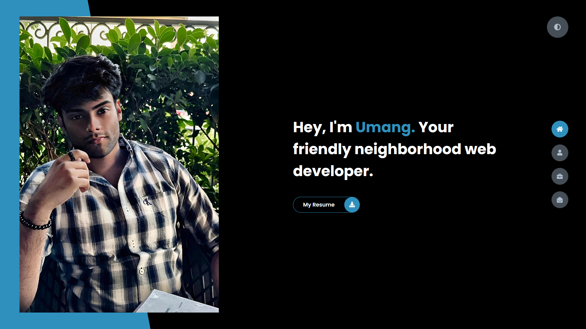
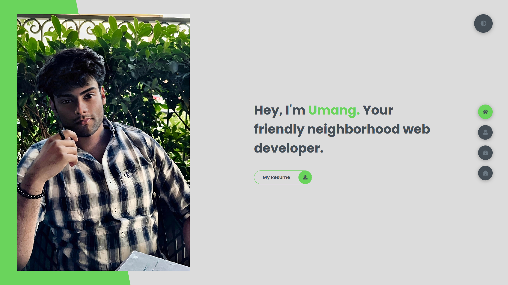
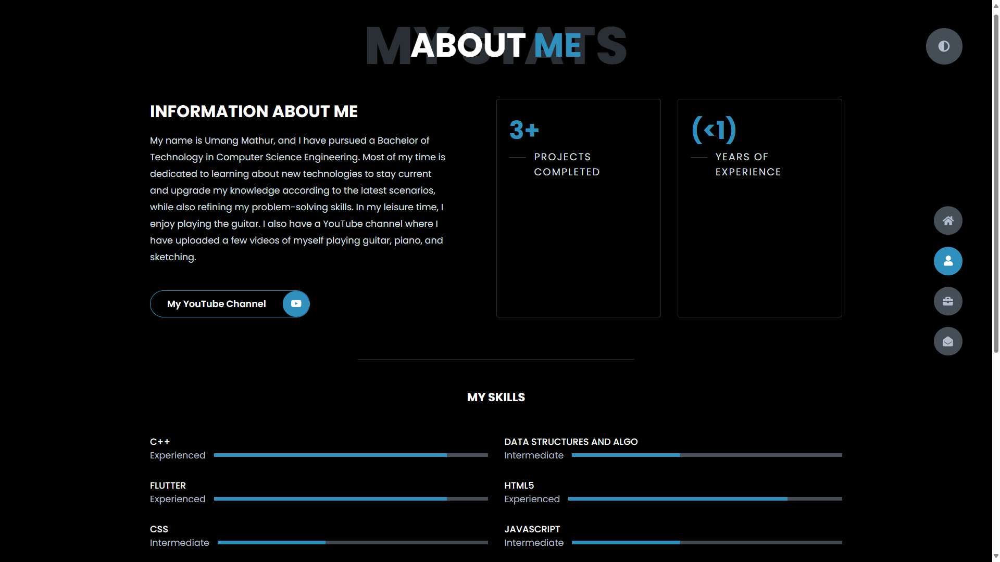
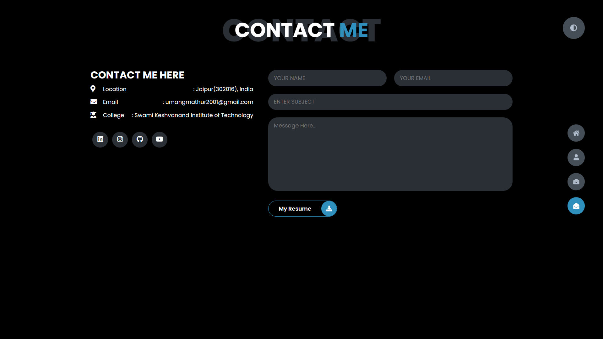
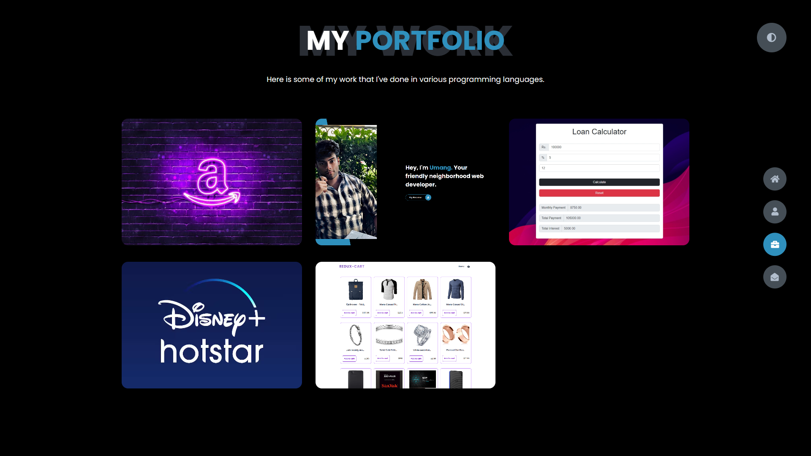
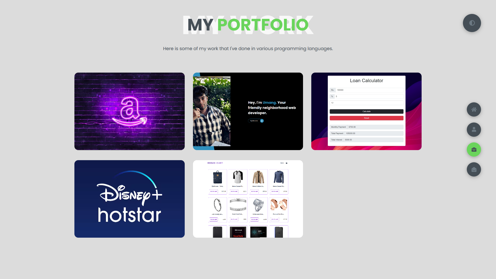

# Personal Portfolio Website

Welcome to my personal portfolio website repository! This project showcases my skills and projects in web development, created using HTML, CSS, and JavaScript. The website incorporates cool animations with smooth transitions, providing a seamless navigation experience for users.

## Features

- **Cool Animations**: The website utilizes animations to enhance user engagement and create an interactive experience.
- **Smooth Transitions**: Seamless transitions between pages and elements contribute to a polished and professional appearance.
- **Project Showcase**: Visitors can explore the projects I have created, along with detailed information about each project.
- **GitHub Repositories**: Easy access to GitHub repositories allows users to view the code and contribute to my projects with just one click.
- **Academic Scores**: Information about my academic scores and achievements is provided, giving visitors insight into my educational background.
- **Dark/Light Mode**: Users can toggle between dark mode and light mode using a convenient button, providing a customizable viewing experience.

## Technologies Used

- HTML
- CSS
- JavaScript

## Screenshots

## Usage

To view the website and explore my projects, simply visit [your-website-url.com](https://www.example.com).

## Contributing

Contributions are welcome! If you have any suggestions, improvements, or bug fixes, feel free to open an issue or submit a pull request.

## License

This project is licensed under the [MIT License](LICENSE). Feel free to use and modify the code according to your needs.

## Acknowledgements

Special thanks to [name] for inspiration and guidance during the development of this project.

---

Thank you for visiting my repository! I hope you enjoy exploring my portfolio website. If you have any questions or feedback, please don't hesitate to contact me.
